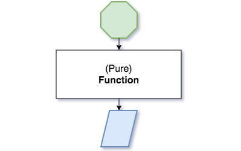
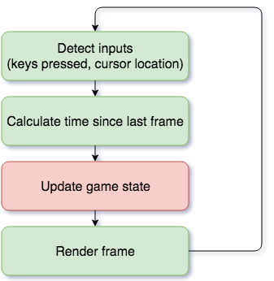

flatMappy bird
===

Martin Carolan

https://github.com/mcarolan/flatmappy-bird

@mcarolan88
mail@mcarolan.net

---



1. The function always evaluates the same result value given the same argument value(s)
2. Evaluation of the result does not cause any semantically observable side effect or output


---
Rough outline:
* Quick demo
* Introduce game loop, and concept of coroutine
* Show how each game concept is a coroutine
* Live coding (?) of how to do e.g. time between frames

---

Why are pure functions &#x1f44d;?
===

+ Easy to reason about
+ Easy to test
+ Easy to parallelise

Why can they be &#x1f44e;?
===

- Often hard to tune performance

---

Structure of a game loop
===


Thought: to show coroutine duplicate horizontally with inputs (time, keyboard) coming in each

---


* Commonly impure
* This is often a conscious and valid design decision
* Let's not be common
---

```scala
CoRoutine[A, B]
```
* It produces a varying value of type `B` from a varying value of type `A`
* A method is designed to return 1 result from 1 input
 	* In a `CoRoutine`, the execution will yield multiple results, and pause/resume between inputs
 	* The path of execution will be altered depending on inputs

---

What changes in flatMappy bird?
===
3 things


---

The player
===


the player's Y coordinate is *dependent* on 2 things:

* Keyboard input - jumps when the spacebar is pressed
* Time - falls towards the ground at a constant rate

```scala
case class Player(yPosition: Double)
val player: CoRoutine[(Set[KeyCode], Time), Player] = ???
```

---

The pipe
===
The pipe (enemy) is *dependent* on 1 thing:


* Time - moves towards the left at a constant rate

```scala
case class Pipe(gapYCoordinate: Double, currentX: Double)
val pipe: CoRoutine[Time, Pipe] = ???
```
---

The game
===

The state of our game changes: we are either winning or have lost

The game state is dependent on 2 things:
* The player: has the player moved off-screen?
* The pipe: is the player touching me?

```scala
case class GameState(pipe: Pipe, player: Player, 
    isGameOver: Boolean)
    
val gameState: CoRoutine[(Pipe, Player), GameState]
```

---

Yes, but let's simplify our problem a bit to make my job easier

So, is it possible to build a pure function
```scala
Time => YCoordinate
```
to represent our player?

---

New concept alarm:
```scala
CoRoutine[A, B]
```
> It produces a varying value of type `B` from a varying value of type `A`

So, we want a `CoRoutine[Time, YCoordinate]`

---

At the core of a `CoRoutine[A, B]` is a function `run`:

```scala
trait CoRoutine[A, B] {
    def run(input: A): (B, CoRoutine[A, B])
}
```

* You give it a value of type `A`
* You'll get back:
	* A value of type `B`; **and**
	* A coroutine that should be used to perform the next computation
---

Now we can define
`val firstFrame: CoRoutine[(Set[KeyCode], Time), YCoordinate] = ???` 
The `run` function of `firstFrame` would give us:
* The game state of the first frame; **and**
* Another `CoRoutine` to be used to generate the second frame

diagram of new game loop?
---
References
===
https://en.wikipedia.org/wiki/Pure_function