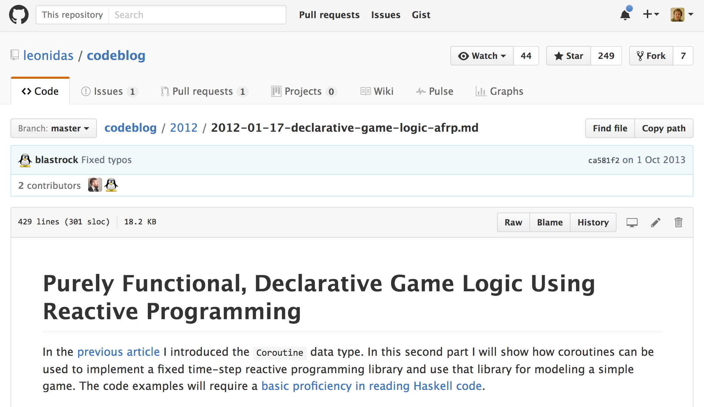
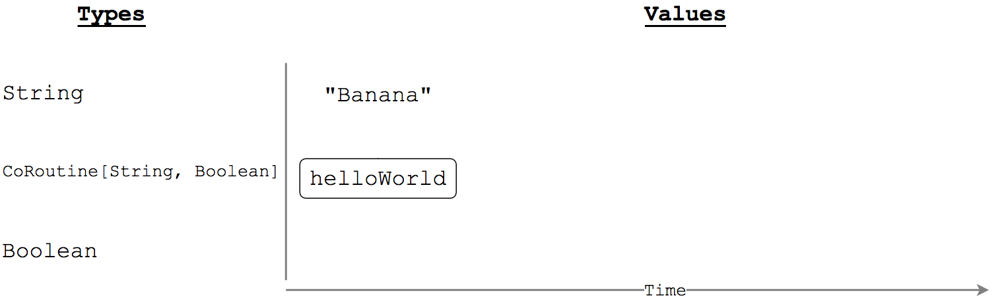
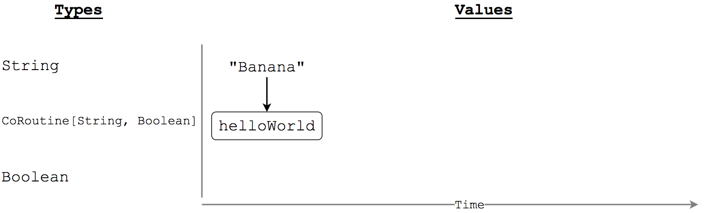
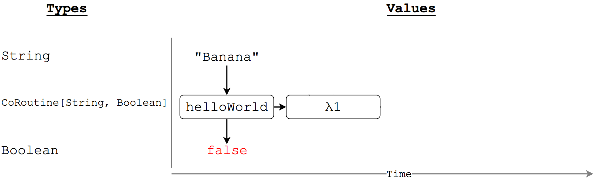
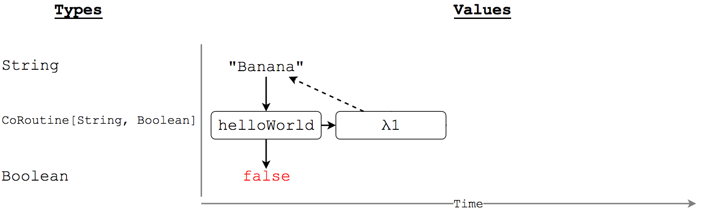
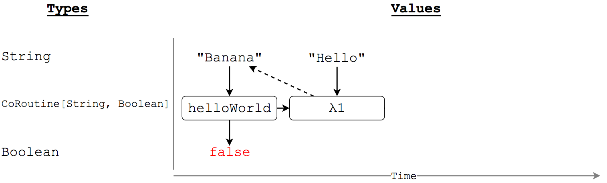
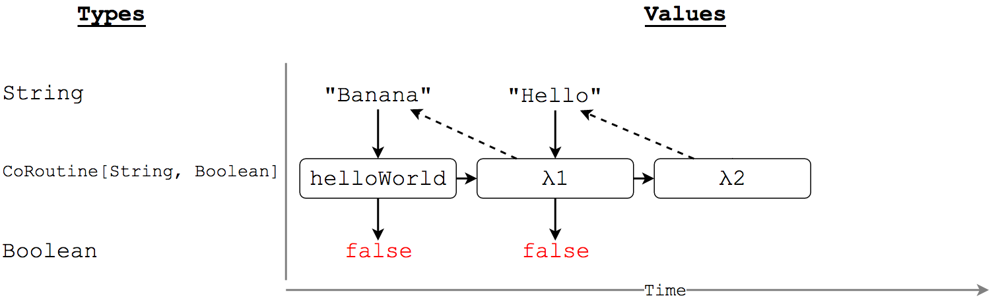
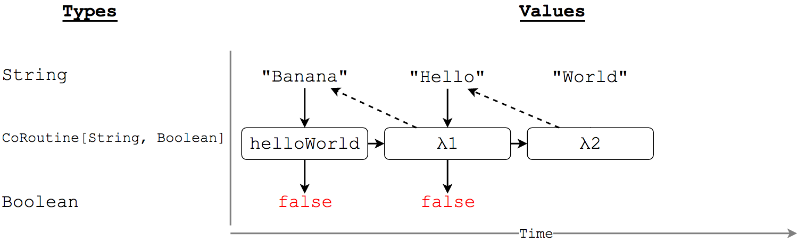
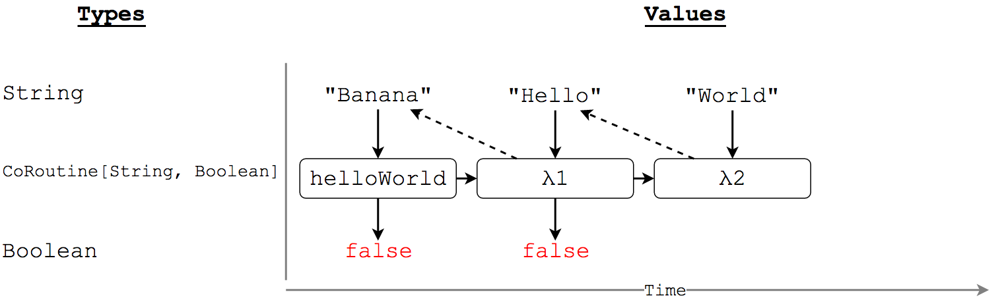
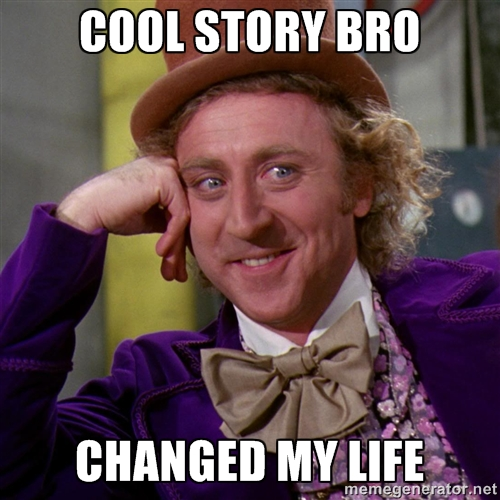

<!-- page_number: true -->

flatMappy bird
===

Martin Carolan

https://github.com/mcarolan/flatmappy-bird

@mcarolan88
mail@mcarolan.net


---

How did this all start?
===

---


---


---


---


---
 


---


---


---


---


---


---


http://www.lihaoyi.com/hands-on-scala-js/

---


---


---

  ░░░░░░▄▄▄▄▄▄▄▄▄▄▄
░░░░▄▀▀░░░░░░░░░▀▀▄
░░▄▀░░░░░░░░░░░░░░░▀▄
░▄▀░░░░░███░░░░░░░░░░▀▄
░█░░░░░░░░██░░░░░░░░░░█
░█░░░░░░░░░██░░░░░░░░░█
█░░░░░░░░░████░░░░░░░░░█
█░░░░░░░░██░░██░░░░░░░░█
█░░░░░░░██░░░░██░░░░░░░█
░█░░░░░██░░░░░░██░██░░█
░█░░░░██░░░░░░░░███░░░█
░▀▄░░░░░░░░░░░░░░░░░░▄▀
░░░▀▄░░░░░░░░░░░░░░▄▀
░░░░░▀▄▄░░░░░░░░▄▄▀
░░░░░░░▀▀▀▀▀▀▀▀▀▀

---


---


https://github.com/leonidas/codeblog/blob/master/2012/2012-01-08-streams-coroutines.md

https://github.com/leonidas/codeblog/blob/master/2012/2012-01-17-declarative-game-logic-afrp.md

---

CoRoutine
===

---

CoRoutine
===

Transformers of time varying values, e.g:
* Head of a queue
* Keyboard state
* Temperature

---

Problem
===

There is a time varying `String` value.

We want to transform it to a time varying `Boolean`:

* The latest value of the `String` is "World"
AND

* The previous value of the `String` was "Hello"

---


---



---



---



---



---


---



---



---



---



---


---

```scala
trait CoRoutine[A, B] {
  def apply(input: A): (B, CoRoutine[A, B])
}
```

---



Ok interesting, where's the game?
===

---

Demo
==

---

What time varying values are in this game?
===

---


---


---

CoRoutine as a game loop
===

---


---


---

```scala
val game: CoRoutine[(Set[Key], Time), GameState] = ???
```
---

Composition
===

```scala
def >>>[A, B, C](first: CoRoutine[A, B], 
  second: CoRoutine[B, C]): CoRoutine[A, C] = ???
```

---

Case Study
===


---

Thank you!
===

I hope you have taken away:

* A feeling for how FRP, and CoRoutine's work
* Pride in functional programming
* A couple of hints about where to start building your own pure game:
  * https://github.com/leonidas/codeblog/blob/master/2012/2012-01-08-streams-coroutines.md
  * https://github.com/leonidas/codeblog/blob/master/2012/2012-01-17-declarative-game-logic-afrp.md
  * http://www.lihaoyi.com/hands-on-scala-js/

---


Images
https://www.flickr.com/photos/68748051@N06/17245319011/in/photolist-sgULwp-6NjbcS-6NizoG-7FeSqV-s1ABG-8KxDVJ-7FeShv-6L8LSj-qmoZSv-41tPh-7EGmqL-7ECvgp-7WKuD6-7Ftp51-69yuWM-7D4iJs-ysASBu-55maCP-5Y7Ftn-9F9iT8-FWfhHX-68aGHc-68aEAg-5Y7fHc-6NdZsM-7WKtBT-89K15a-89K2fa-69yvFZ-89NgzN-69yudv-5Y7D5H-5YbWsS-7WKvAg-6NdYNc-89Nfub-69CHmW-6NManP-5Y7uCR-6QUJuG-8uZa7X-5Y7bZ6-7WKsKi-5YbwEw-5YbBuA-F7QRCX-68aHjH-68eVg7-68eQWU-68aKrH

https://www.flickr.com/photos/8391775@N05/2647820096/in/photolist-52YLEC-og26Uw-qD6nPX-fsc3gg-ojvUtm-cog1MC-pCRYyD-m59Uvp-qVtehE-f6gWNo-6gSN3D-62S8SF-eeKffV-dmzpst-iEk3gq-pkBUCf-6gWYMQ-bY6unh-bhr6nR-dyQCz6-p22Tec-dFrYyS-oikHZA-iw7EwN-fSgD5G-iw7oHb-piprvS-pDoQHS-cwmjDq-bzNs2o-nQQy6D-dr8mXV-JydfXA-dQzd3Y-nyEbBV-6fqUYs-kXWoqM-7VJJwn-fShHzK-pacjcC-dQoxVb-hYtWXv-dWpdfk-czKUrf-cpw9Vo-cAV7m9-dQowXs-dTfKxn-nqvXvt-o54936

https://www.flickr.com/photos/jonathankosread/6184019357/in/photolist-aqsHvp-2g17mh-dR3Y9x-gponG-kKZytZ-pNhwM5-77ihw8-oTwyQb-dteNS-bkSYHH-4u3pAF-a6Yj8h-6pypTD-kZSzJ3-fcryvD-ajC5LU-9De9QT-7zizEa-eCgF8-kj3Ru-eV1rEG-aEuC9-6dVK9j-6pypBR-jm7aq-5g1duM-xoEbF2-o5epCf-6pCXbS-6h6Zu8-6pyiwZ-6pCvB7-6pCy21-4cog75-7AcTfS-e6XAqK-4uo2MP-6pCs1m-6ASZJU-e1YtBB-6huVMT-d2iPZW-8jEqvi-977fud-6A7aJZ-6vmzV-gjmyZ-69QmoH-8cNM7c-pTTjA

http://www.deviantart.com/art/Gaming-Icons-179546229

https://www.flickr.com/photos/marianopaulin02/16895155137/in/photolist-rJY61e-dN1SXG-49sN6T-dZa635-tfS3xJ-tfTcFJ-xNNHo6-bvVDie-wR9Mt9-5Z5q7d-o4EsFw-7q9qBF-6dYoeL-4qyEp4-cRGCeL-72tLMF-bFxRCV-5tWxwf-5tWxV3-7x7o1q-d8atD7-5tSaJe-4nWKA7-ese74Y-xAMYw-4myiwF-oqisgw-cRGCnh-9BVHmk-7dcFo-8jqLdc-6sHJFL-6yq1bj-g9FyfG-DWtde-7bNZYS-cRGCD1-662Gp4-cRJxT1-7edja8-bw1FpU-kZo7LT-4WrmRD-obNw2V-69W4Z4-7FSUUK-c55zTU-7TawMW-d8auR5-36Tf5s


https://www.flickr.com/photos/thicke/464496227/in/photolist-H3ExD-ospJTL-29Miw-5isF5V-6ewAQi-eh53PE-6Vuo3b-8u5mxh-dJB1bX-iPiRWh-5TWh8r-dJGwGu-g5bvm5-5eMDfX-4XKeNG-7h1HFd-2TGi3-pX97Sm-3uwW5W-7DZ15M-59CNS1-9FYWTF-pGd3Vw-riTE4Y-g5c4Xr-7fMKPp-7fMKVc-dPixX6-pFk8Tm-2bo1gV-g5cq1c-pSuBc7-g5bJ6A-771PTZ-3EAXLg-2TGor-ddNukK-p2c49f-7Dmq9t-bg2KEK-8fPfZM-7fRG73-i6gNrM-bBXoqb-7fRFVE-acS5Ec-hkGCie-9YZ69h-o5tS8Q-5ZdQv2

http://sharpwriter.deviantart.com/art/Welcome-to-the-Internet-Please-Follow-me-322248378

https://www.flickr.com/photos/gilles_dubochet/7327041044

https://blogs.gov.scot/marketing/2015/01/09/new-year-lighter-load/

http://static-media.fxx.com/img/FX_Networks_-_FXX/684/907/Simpsons_12_06_P1.jpg?resize=600

https://cdn.meme.am/instances/500x/67598366.jpg
